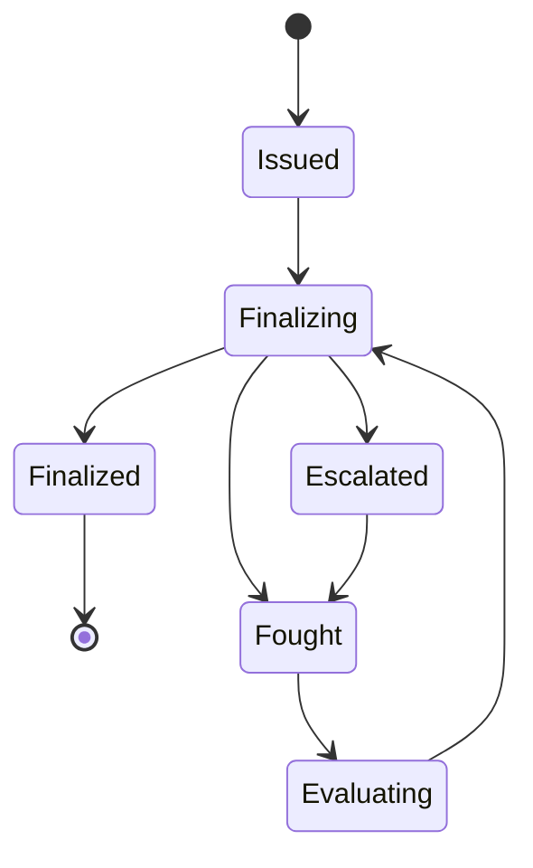

# Dispute Resolution

## Overview
Dispute resolution is on-chain dispute resolving process to help resolve conflicts between payment parties.

There are two main states of the dispute resolving process:

**Initial dispute:** In the first phase, only the payer can issue the dispute. To create a dispute, the payer needs to submit the evidence and deposit the dispute fee. If the payee does not fight the dispute, the locked fund and deposit fee will be released to the payer. Otherwise, the payee also needs to submit evidence and deposit a dispute fee to fight the dispute. In this case, a random resolver from the resolvers network will be assigned to the dispute. The resolver needs to evaluate the evidence and make a judgment on the dispute. If both the payer and payee accept the judgment, the dispute will be finalized after a waiting time. Depending on the outcome, the locked fund and dispute fee will release to the winner while the dispute fee of the loser will transfer to the resolver.

**Escalation:** If the payer or payee does not accept the judgment, the dispute will move to the escalation phase. There will be more random resolvers that are assigned to re-investigating the dispute. The final result will depend on the voting result of resolvers, including the previous rounds. Those who disagree with the result will have a chance to escalate again with more new resolvers added. The number of resolvers involved should always be odd, so majority votes can be conducted if necessary.  There is no limitation on escalate times but the fee will increase after each time depending on the number of resolvers. It not only helps to prevent the spam attack but also forces the participant to consider carefully before escalating the dispute.

**Dispute state change**



## Usage
### For payment parties
**Issue a dispute**
```rs
pub fn create_dispute(
  origin: OriginFor<T> // Only payer is accepted
  payment_hash: HashOf<T>,
  argument: Vec<u8>
)
```
**Fight a dispute**
```rs
pub fn create_dispute(
  origin: OriginFor<T> // Only payer is accepted
  payment_hash: HashOf<T>,
  argument: Vec<u8>
)
```

### Resolvers
**Make the judgment after the evaluation and investigation**
```rs
pub fn propose_outcome(
  origin: OriginFor<T>,
  payment_hash: HashOf<T>,
  judgment: Judgment,
)
```
